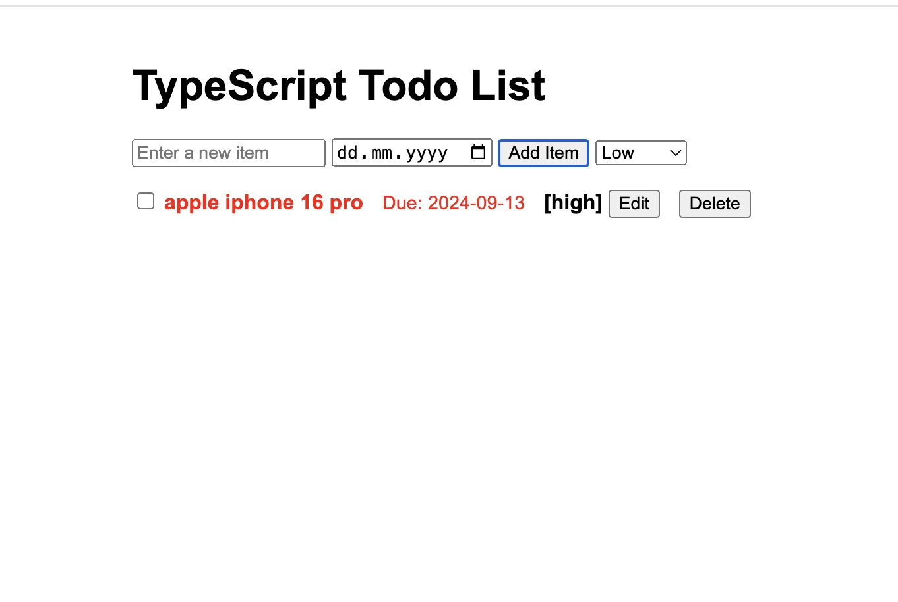

# TypeScript Web App

This is a basic web application built with TypeScript and Express.js. It serves as a starting point for developing more complex web applications using TypeScript.

## Prerequisites

Before you begin, ensure you have met the following requirements:

* You have installed the latest version of [Node.js and npm](https://nodejs.org/en/download/)
* You have a basic understanding of TypeScript and Express.js

## Installing TypeScript Web App

To install the TypeScript Web App, follow these steps:

1. Clone the repository:
   ```
   git clone https://github.com/yourusername/typescript-web-app.git
   ```
2. Navigate to the project directory:
   ```
   cd typescript-web-app
   ```
3. Install the dependencies:
   ```
   npm install
   ```

## Configuring the Application

1. Create a `.env` file in the root directory of the project.
2. Add the following environment variables to the `.env` file:
   ```
   PORT=3000
   NODE_ENV=development
   ```
   Adjust these values as needed for your environment.

## Running TypeScript Web App

To run the TypeScript Web App, follow these steps:

1. Start the development server:
   ```
   npm start
   ```
2. Open your web browser and navigate to `http://localhost:3000` (or whatever port you specified in your `.env` file).

## Building the Application

To compile the TypeScript code to JavaScript, run:

```
npm run build
```

This will create a `dist` directory with the compiled JavaScript files.

## Project Structure

```
typescript-web-app/
│
├── src/
│   └── app.ts
│
├── dist/
│
├── .env
├── .gitignore
├── package.json
├── tsconfig.json
└── README.md
```

## Contributing to TypeScript Web App

To contribute to TypeScript Web App, follow these steps:

1. Fork this repository.
2. Create a branch: `git checkout -b <branch_name>`.
3. Make your changes and commit them: `git commit -m '<commit_message>'`
4. Push to the original branch: `git push origin <project_name>/<location>`
5. Create the pull request.

Alternatively, see the GitHub documentation on [creating a pull request](https://help.github.com/en/github/collaborating-with-issues-and-pull-requests/creating-a-pull-request).

## Contact

If you want to contact me, you can reach me. 

## License

This project uses the following license: [MIT License](<https://github.com/incendies/todo-app-with-typescript/blob/main/LICENSE>).